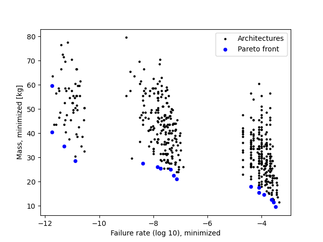
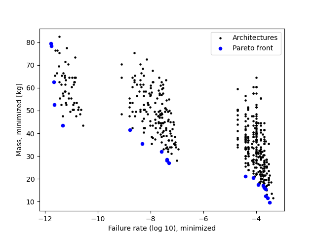

# Guidance, Navigation and Control Test Problem: SysML v2 Implementation

This repository contains the implementation of the
[GNC test problem](https://github.com/jbussemaker/SBArchOpt/blob/main/sb_arch_opt/problems/gnc.py)
using SysML v2.
It demonstrates the application of the "Architecture Design" library developed in the
[ODE4HERA](https://www.ode4hera.eu/) project for the purpose of System Architecture Optimization (SAO).

This repository accompanies the paper:

Bussemaker, J.H., et al., (2026) "System Architecture Optimization Using SyML v2: Language Extension and Implementation", IEEE SYSCON 2026, Halifax, Canada.

The GNC problem is a bi-objective SAO test problem,
that features the selection of the types and amount of sensors, computers and actuators, and how to connect them.
The objectives are to minimize total mass and minimize failure probability.
For more details, refer to Section 3.6.2 of [Jasper Bussemaker's dissertation](https://repository.tudelft.nl/record/uuid:246b18f9-1f8c-4ff7-b824-2b1786cf9d14).

The purpose is to demonstrate how an architecture optimization problem can be implemented using ADORE and SysML v2.
The optimization results are the same compared to the reference implementation in [SBArchOpt](https://sbarchopt.readthedocs.io/).

SysML v2 implementation:

Reference implementation:

## Repository Contents

The repository has the following contents:

- `model`
  - `base/gnc_base.sysml`: base file which was imported to ADORE and exported to `model/gnc.sysml`
  - `library/ArchitectureDesign.sysml`: the Architecture Design library, also available from [Sysand](https://sysand.org/)
  - `gnc.sysml`: the SysML v2 model of the GNC design space
  - `gnc.adore`/`gnc.html`: the ADORE model of the GNC design space (synchronized with the SysML v2 model) and its standalone HTML export
- `evaluator.py`: Python script implementing the evaluation of the mass and failure rate metrics for a given architecture instance
- `reference_optimization.py`: Python script to execute the optimization of the reference (pure-Python) implementation of the GNC problem: execute it to observe the evaluation of the `annotated_example_architecture`
- `results`
  - `annotated_example_architecture.sysml`: Example architecture instance in SysML v2
  - `optimization_50_10`: optimization results of the GNC SysML v2 implementation
  - `ref_optimization_50_10`: optimization results of the reference implementation
  - `testing`: results of testing the evaluator script

Note that the repository does not include the propietary [ADORE](https://adore.mbse-env.com/docs/) to SysML v2 coupling code, as would be needed to actually generate new architectures.

## Installation

For viewing the SysML v2 models in the repository,
we recommend using the [Syside Editor](https://marketplace.visualstudio.com/items?itemName=sensmetry.syside-editor) plugin in VS Code.

For running the evaluator Python scripts, create a Python environment (Python 3.12) and run:

`pip install numpy syside`

Note that it requires [Syside Automator](https://docs.sensmetry.com/automator/index.html), which is proprietary software. Refer to [their instructions](https://docs.sensmetry.com/automator/install.html) for how to setup the license.

For running the reference optimization, implemented in [SBArchOpt](https://sbarchopt.readthedocs.io/), run: `pip install sb-arch-opt`
